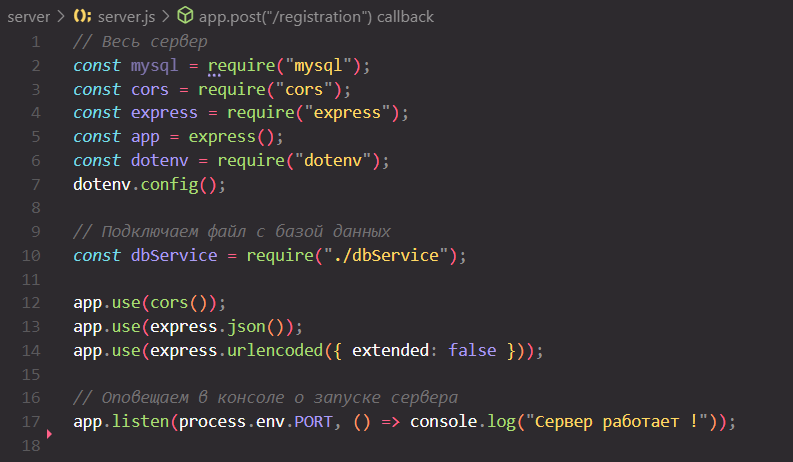
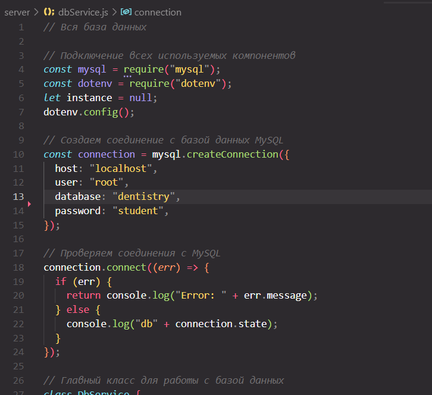
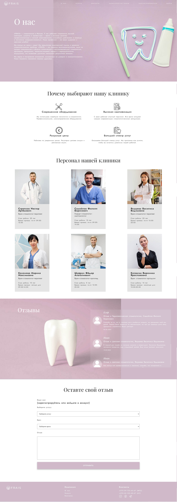
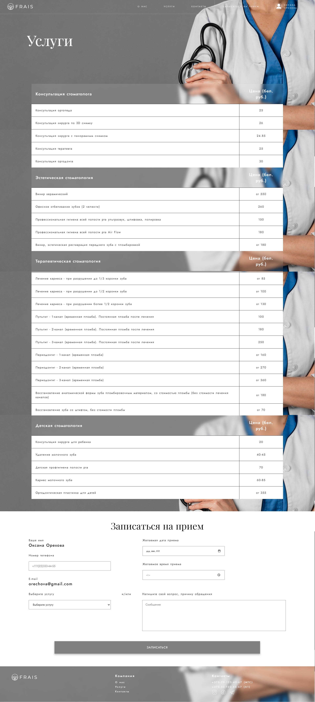
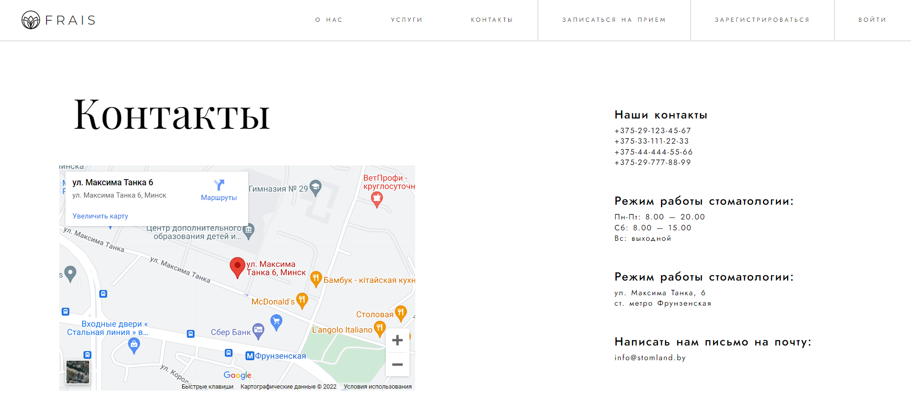
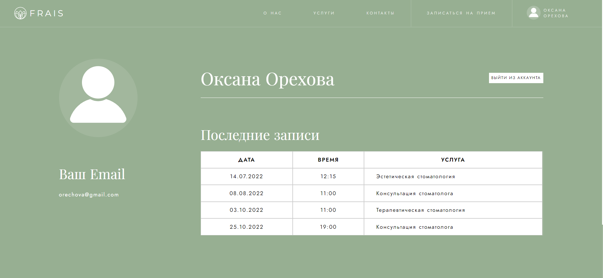
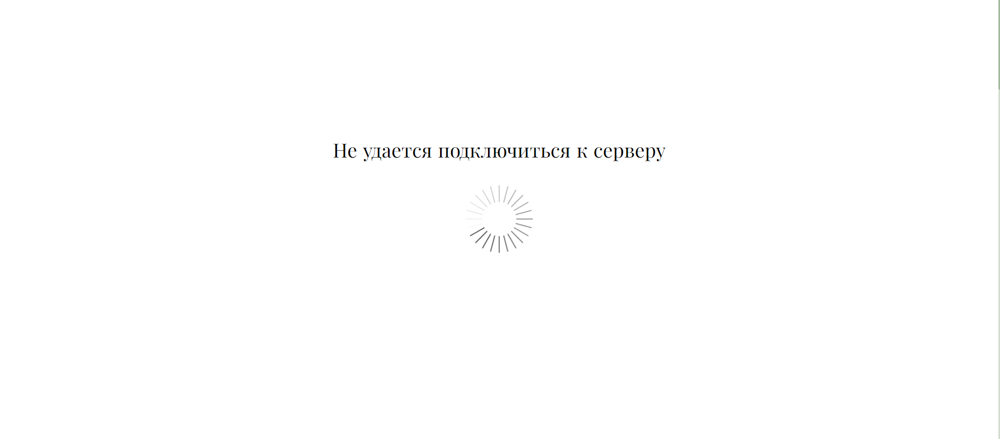

<h1>Web site for dentistry</h1>
<h2>About progect</h2>

This project is a coursework for the university created by two students: <a href="https://github.com/yanakapura">Yana Kapura</a> and <a href="https://github.com/ValeriaTripuz">Valeria Tripuz</a>.

The main tasks were:

<ol>
  <li>A client-server application</li>
  <li>Connecting to a MySQL database</li>
  <li>Registration and authorization of users</li>
  <li>Ability to leave feedback</li>
  <li>Ability of making an appointment</li>
  <li>Ability to view reviews from other patients</li>
  <li>Ability to view reference information about the schedule of doctors</li>
  <li>
    Ability to view reference information about the services provided and their
    cost
  </li>
</ol>

As a result, all the tasks were completed.

  A MySQL database was created (the dentistry.sql file for installing the
  database is contained in the project) The server (server folder) is created on
  Node.js, it connects to BD and processes user requests.

<figure>
  
  <figcaption>Server creation</figcaption>
</figure>

<figure>
  
  <figcaption>Database connection</figcaption>
</figure>

  The dentistry website contains the main page, the "About us" page, the
  "Services" page, the "Contacts" page, as well as the user's personal page.

<figure>
  
  <figcaption>Main page</figcaption>
</figure>

  Page "About us" contains information about the company, a gallery of doctors
  with information about them, customer reviews, as well as a feedback form.
  Information about doctors and comments are requested from the database. New
  comments are added to the database

<figure>
  
  <figcaption>page "About us"</figcaption>
</figure>

  The "Services" page contains information about the services provided and
  prices for them (data is requested from the database) and including an
  appointment form (data is responsing to the database).

<i>(Background image is fixed)</i>
<figure>
  
  <figcaption>page "Services"</figcaption>
</figure>

The "Contacts" page contains company's contacts and imported Google map

<figure>
  
  <figcaption>page "Contacts"</figcaption>
</figure>

  The user's personal page contains information about the client, his name,
  email, and all his records received from the database. There is also a logout
  button on the page.

<figure>
  
  <figcaption>User's personal page</figcaption>
</figure>

If the client cannot connect/loses connection to the server, the following message is displayed on the screen: "Unable to connect to the server"

<h2>How to install</h2>

To install the project, you need:

<ol>
  <li>Download the zip with the project from GitHub.</li>
  <li>Install the database from the file dentistry.sql.</li>
  <li>Connect to DB by changing the password to connect on the server to your own.</li>
  <li>Start the server with the console command "node server.js"</li>
  <li>Start the client (index.html) in the browser</li>
</ol>
